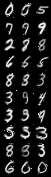

<div align="center">    
 
# Ambiguous Datasets     

</div>
 
## Description   
This repository contains ambiguous datasets generated using a conditional variational autoencoder (CVAE) approach. The datasets contain images that are ambiguous between a pair of classes. This class interpolation is done by conditional generation through the CVAE with a class-vector and mixing factor that gives ambiguous readout class-probability for the digit pair. Currently, only MNIST and EMNIST are supported, but the codebase is general enough that new datasets could be easily added.

## How to run   
First, install dependencies   
```bash
# clone project   
git clone https://github.com/ABL-Lab/ambiguous-dataset

# install project   
cd ambiguous-dataset 
pip install -e .   
pip install -r requirements.txt
```
### download ambiguous datasets (A-MNIST and A-EMNIST)
A-MNIST google drive link: https://drive.google.com/file/d/1YhaetgET00mPhXBzPCAtLQN6nrh9ByFX/view?usp=sharing 

A-EMNIST google drive link:

### download trained model weights for experiments
google drive link: https://drive.google.com/file/d/1Vi9ikbXnsY2mJshFlJn9XCzsw-Kw57QI/view?usp=sharing 

unzip into a folder then:

```python
from ambiguous.models.vae import MLPVAE
from ambiguous.models.readout import Readout
from ambiguous.models.cvae import Conv_CVAE

device='cuda' if torch.cuda.is_available() else 'cpu'

vae_path, readout_path, ccvae_path = ..., ..., ...
vae = MLPVAE(latent_dim=10, input_img_size=28).to(device)
vae.load_state_dict(torch.load(vae_path))

readout = Readout(latent_dim=10, h=512, n_classes=10).to(device)
readout.load_state_dict(torch.load(readout_path))

ccvae = Conv_CVAE(latent_dim=10,n_cls=10).to(device)
ccvae.load_state_dict(torch.load(ccvae_path))
```
if using cpu, pass map_location='cpu' when calling torch.load()

## Importing Ambiguous Dataset to your own project
This project is setup as a package which means you can easily import any file into any other file like so.
```python
from ambiguous.dataset.dataset import DatasetFromNPY, DatasetTriplet


root = 'path_to_ambiguous_dataset'
# older version
#trainset = DatasetFromNPY(root=root, download=False, train=True, transform=None)
#testset = DatasetFromNPY(root=root, download=False, train=False, transform=None)

# new version
trainset = DatasetTriplet(root=root, train=True, transform=None)
testset = DatasetTriplet(root=root, train=False, transform=None)

trainloader = DataLoader(trainset, batch_size=64, shuffle=True)
testloader = DataLoader(testset, batch_size=64, shuffle=False)
(clean1, amb, clean2), label = next(iter(amnist_loader))
```
Here are some examples of the generated triplets (clean, ambiguous, clean):



<!-- ## Saving a custom ambiguous dataset
```python
from ambiguous.dataset.dataset import save_dataset_to_file, DatasetFromNPY

# This part could take some time
save_dataset_to_file(dataset_name='EMNIST',
                     og_root=path_to_emnist,
                     new_root=path_to_ambiguous_emnist,
                     pairs=your_class_pairs,
                     blend=0.5)
   
# Then load dataset as before
trainset = DatasetFromNPY(root=path_to_ambiguous_emnist, download=False, train=True, transform=None)
trainloader = DataLoader(trainset, batch_size=64, shuffle=True)
``` -->

### Citation   
```
@article{YourName,
  title={Your Title},
  author={Your team},
  journal={Location},
  year={Year}
}
```   
